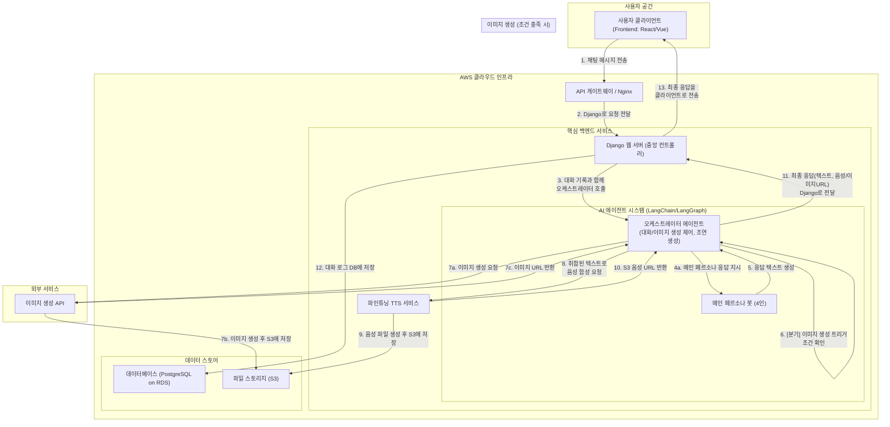

```mermaid
graph TD
    subgraph "사용자 공간"
        UserClient["사용자 클라이언트 (Frontend: React/Vue)"]
    end

subgraph "외부 서비스"
    ImageGenAPI["이미지 생성 API"]
end

subgraph "AWS 클라우드 인프라"
    APIGateway["API 게이트웨이 / Nginx"]
    
    subgraph "핵심 백엔드 서비스"
        Django["Django 웹 서버 (중앙 컨트롤러)"]
        
        subgraph "AI 에이전트 시스템 (LangChain/LangGraph)"
            Orchestrator["오케스트레이터 에이전트<br/>(대화/이미지 생성 제어, 조연 생성)"]
            MainPersonas["메인 페르소나 봇 (4인)"]
        end

        TTSService["파인튜닝 TTS 서비스"]
    end

    subgraph "데이터 스토어"
        RDS["데이터베이스 (PostgreSQL on RDS)"]
        S3["파일 스토리지 (S3)"]
    end
end

%% --- 그룹 DM (AI 페르소나 채팅 + 이미지 생성) 흐름 ---
UserClient -- "1. 채팅 메시지 전송" --> APIGateway
APIGateway -- "2. Django로 요청 전달" --> Django
Django -- "3. 대화 기록과 함께<br/>오케스트레이터 호출" --> Orchestrator

%% AI 에이전트 내부 로직
Orchestrator -- "4a. 메인 페르소나 응답 지시" --> MainPersonas
Orchestrator -- "4b. (필요시) 조연 캐릭터 대사 직접 생성" --> Orchestrator

MainPersonas -- "5. 응답 텍스트 생성" --> Orchestrator

Orchestrator -- "6. [분기] 이미지 생성 트리거<br/>조건 확인" --> Orchestrator

subgraph "이미지 생성 (조건 충족 시)"
    Orchestrator -- "7a. 이미지 생성 요청" --> ImageGenAPI
    ImageGenAPI -- "7b. 이미지 생성 후 S3에 저장" --> S3
    ImageGenAPI -- "7c. 이미지 URL 반환" --> Orchestrator
end

Orchestrator -- "8. 취합된 텍스트로<br/>음성 합성 요청" --> TTSService
TTSService -- "9. 음성 파일 생성 후 S3에 저장" --> S3
TTSService -- "10. S3 음성 URL 반환" --> Orchestrator

Orchestrator -- "11. 최종 응답(텍스트, 음성/이미지URL)<br/>Django로 전달" --> Django

Django -- "12. 대화 로그 DB에 저장" --> RDS
Django -- "13. 최종 응답을<br/>클라이언트로 전송" --> UserClient


  
```

