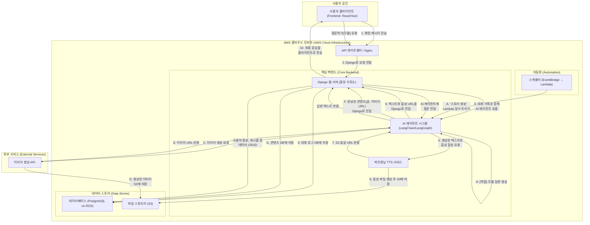

```mermaid
graph TD
    subgraph "사용자 공간"
        UserClient["사용자 클라이언트 (Frontend: React/Vue)"]
    end

subgraph "외부 서비스 (External Services)"
    ImageGenAPI["이미지 생성 API"]
end

subgraph "AWS 클라우드 인프라 (AWS Cloud Infrastructure)"
    APIGateway["API 게이트웨이 / Nginx"]
    
    subgraph "핵심 백엔드 (Core Backend)"
        Django["Django 웹 서버 (중앙 지휘소)"]
        AIAgent["AI 에이전트 시스템 (LangChain/LangGraph)"]
        TTSService["파인튜닝 TTS 서비스"]
    end

    subgraph "자동화 (Automation)"
        Scheduler["스케줄러 (EventBridge → Lambda)"]
    end

    subgraph "데이터 스토어 (Data Stores)"
        RDS["데이터베이스 (PostgreSQL on RDS)"]
        S3["파일 스토리지 (S3)"]
    end
end

%% --- 1. 그룹 DM (실시간 대화) 흐름 ---
UserClient -- "1. 채팅 메시지 전송" --> APIGateway
APIGateway -- "2. Django로 요청 전달" --> Django
Django -- "3. 대화 기록과 함께<br/>AI 에이전트 호출" --> AIAgent
AIAgent -- "4. [역할] DM 대화 생성<br/>(오케스트레이터, 페르소나)" --> AIAgent
AIAgent -- "5. 생성된 텍스트로<br/>음성 합성 요청" --> TTSService
TTSService -- "6. 음성 파일 생성 후 S3에 저장" --> S3
TTSService -- "7. S3 음성 URL 반환" --> AIAgent
AIAgent -- "8. 텍스트와 음성 URL을<br/>Django로 전달" --> Django
Django -- "9. 대화 로그 DB에 저장" --> RDS
Django -- "10. 최종 응답을<br/>클라이언트로 전송" --> UserClient


%% --- 2. 콘텐츠 자동 생성 (스토리/피드) 흐름 ---
Scheduler -- "A. '스토리 생성'<br/>Lambda 함수 트리거" --> AIAgent
AIAgent -- "B. [역할] 피드/스토리<br/>콘텐츠 생성" --> AIAgent
AIAgent -- "C. 이미지 생성 요청" --> ImageGenAPI
ImageGenAPI -- "D. 생성된 이미지<br/>S3에 저장" --> S3
ImageGenAPI -- "E. 이미지 URL 반환" --> AIAgent
AIAgent -- "F. 완성된 콘텐츠(글, 이미지URL)<br/>Django로 전달" --> Django
Django -- "G. 콘텐츠 DB에 저장" --> RDS

%% --- 3. 무물 답변 생성 흐름 ---
UserClient -- "질문하기(무물) 요청" --> APIGateway
Django -- "AI 에이전트에<br/>질문 전달" --> AIAgent
AIAgent -- "H. [역할] 무물 답변 생성" --> AIAgent
AIAgent -- "답변 텍스트 반환" --> Django

%% --- 기타 상호작용 ---
Django -- "사용자 정보, 게시물 등<br/>데이터 CRUD" --> RDS

  
```

