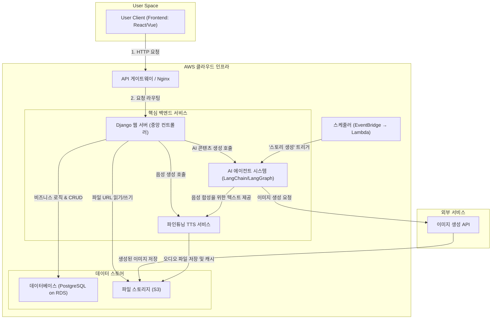

```mermaid
graph TD
    subgraph "User Space"
        UserClient["User Client (Frontend: React/Vue)"]
    end

    subgraph "외부 서비스"
    ImageGenAPI["이미지 생성 API"]
end

subgraph "AWS 클라우드 인프라"
    APIGateway["API 게이트웨이 / Nginx"]
    Scheduler["스케줄러 (EventBridge → Lambda)"]

    subgraph "핵심 백엔드 서비스"
        Django["Django 웹 서버 (중앙 컨트롤러)"]
        AIAgent["AI 에이전트 시스템 (LangChain/LangGraph)"]
        TTSService["파인튜닝 TTS 서비스"]
    end

    subgraph "데이터 스토어"
        RDS["데이터베이스 (PostgreSQL on RDS)"]
        S3["파일 스토리지 (S3)"]
    end
end

%% --- 데이터 흐름 ---
UserClient -- "1. HTTP 요청" --> APIGateway
APIGateway -- "2. 요청 라우팅" --> Django
Django -- "비즈니스 로직 & CRUD" --> RDS
Django -- "AI 콘텐츠 생성 호출" --> AIAgent
Django -- "음성 생성 호출" --> TTSService
Django -- "파일 URL 읽기/쓰기" --> S3
Scheduler -- "'스토리 생성' 트리거" --> AIAgent
AIAgent -- "이미지 생성 요청" --> ImageGenAPI
AIAgent -- "음성 합성을 위한 텍스트 제공" --> TTSService
ImageGenAPI -- "생성된 이미지 저장" --> S3
TTSService -- "오디오 파일 저장 및 캐시" --> S3
  
```

